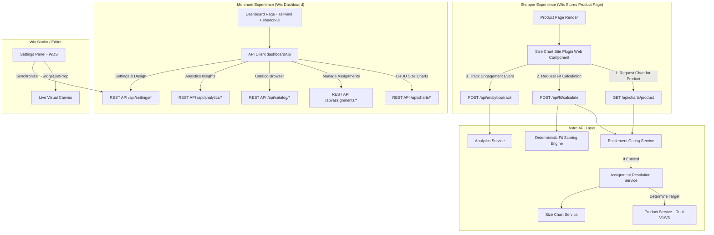

# Architecture & System Design

This document details the architectural design, component interactions, data flows, and design decisions of the **Stores Size Chart & Fit Guide** application.

---

## 1. High-Level System Architecture

---

## 2. Key Subsystems

### 2.1 Dual Wix Stores Catalog Support (V1 & V3)

The application transparently supports both Wix Stores V1 and V3 catalog architectures without manual merchant configuration:

* **Detection Engine**: `catalogVersioning.getCatalogVersion()` queries Wix SDK to determine `'V1_CATALOG'` vs `'V3_CATALOG'`.
* **V3 Architecture**:
  * Product queries via `productsV3.queryProducts()`.
  * Pagination via `cursors.next` and `skipTo(cursor)`.
  * Categories fetched via `collections.queryCollections()`.
* **V1 Architecture**:
  * Product queries via `products.queryProducts()`.
  * Offset-based pagination via `.skip(offset)`.
  * Collections fetched via `collections.queryCollections()`.
* **Unified Model**: Products are transformed into a normalized `WixProductSummary` containing unified ID, name, SKU, price, formatted price, options, choices, and media.

### 2.2 Deterministic Assignment Resolution Engine

When a shopper visits a product page, the assignment engine resolves the appropriate size chart using a strict 4-level deterministic priority:

1. **Level 1 — Product-Specific Assignment**: Highest priority. Directly links a specific product ID to a size chart.
2. **Level 2 — Advanced Rule Assignment**: Evaluates merchant-defined rules based on product properties:
   * Title / Name (contains, startsWith, endsWith, equals)
   * SKU (contains, startsWith, equals)
   * Tags / Keywords
   * Price ranges (greaterThan, lessThan)
3. **Level 3 — Category / Collection Assignment**: Matches any category or collection assigned to the product. Higher priority ranks resolve conflicts between multiple categories.
4. **Level 4 — Default Fallback Chart**: Universal fallback chart displayed if no specific product, rule, or category match is found.

### 2.3 Smart Fit Finder Engine

The Smart Fit Finder calculates size recommendations using pure deterministic mathematics rather than opaque heuristics:

* **Attribute Mapping**: Merchant maps chart columns to standard biometric attributes (`chest`, `waist`, `hip`, `shoulder`, `footLength`, `height`, `weight`).
* **Weighted Distance Calculation**: Attributes are weighted according to garment type (e.g. Chest is High weight for Tops; Waist is High weight for Bottoms):
  $$\text{Score} = 100 - \sum \left( \left| \frac{\text{UserMeasurement} - \text{RangeMidpoint}}{\text{Tolerance}} \right| \times \text{Weight} \right)$$
* **Fit Preference Compensation**:
  * `slim`: Adjusts target thresholds toward lower boundary (-2% to -4%).
  * `regular`: Standard centered alignment.
  * `relaxed`: Adjusts target thresholds toward upper boundary (+3% to +5%).
* **Between-Sizes Arbitration**: When two sizes have comparable fit scores (within 5% difference), the merchant's configured `betweenSizesStrategy` (`'larger'` vs `'smaller'`) resolves the recommendation.

### 2.4 High-Precision Measurement Conversion

* Supports numeric values, floating points, and ranged strings (`"91-97"`, `"91–97 cm"`, `"36 - 38 in"`).
* Automatic two-way conversion constant: $1\text{ in} = 2.54\text{ cm}$.
* Preserves non-measurement text and regional identifiers (e.g., `"Free Size"`, `"One Size"`, `"US 8-10"`).

### 2.5 Server-Side Entitlement & Fail-Safe Design

* Public storefront API (`/api/charts/product`) strictly verifies account billing entitlement server-side.
* If an account is expired, canceled, paused, uninstalled, or exceeds active chart limits:
  * Storefront API returns an empty payload with HTTP 200.
  * The storefront custom element quietly removes its container from the DOM.
  * **Result**: Zero console error exceptions and zero impact on native Wix Stores Product Page rendering and purchase flow.

