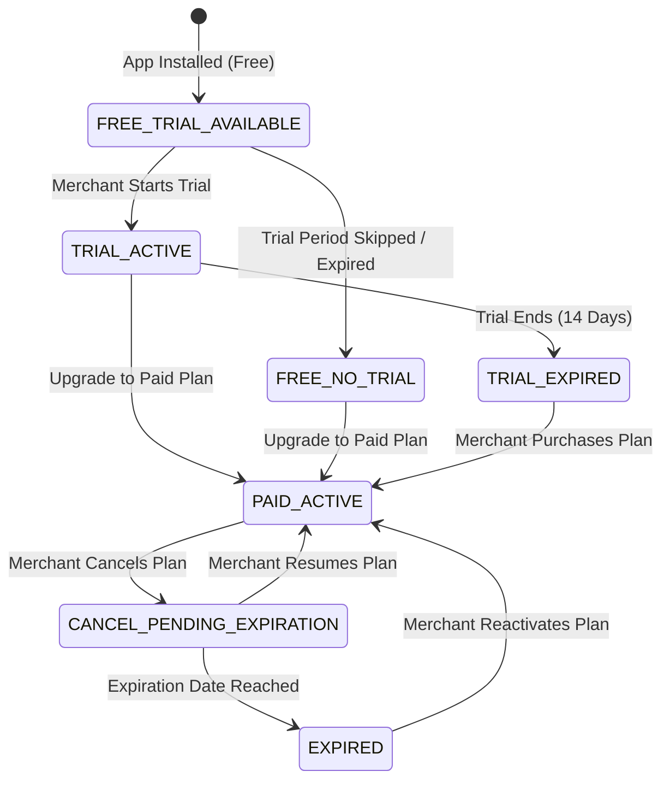

# Billing Lifecycle & Entitlement Management

This document details the multi-state billing lifecycle, plan tier capabilities, and server-side entitlement enforcement for the **Stores Size Chart & Fit Guide** application.

---

## 1. Normalized Billing States

The application normalizes all raw Wix App Instance billing metadata into 7 unambiguous states:

### State Breakdown

1. **`FREE_TRIAL_AVAILABLE`**:
   * Initial state on install if a 14-day free trial is configured and available.
   * Entitled: Yes (Starter features).
   * Banner: Prominent "Start 14-Day Free Pro Trial" banner.

2. **`TRIAL_ACTIVE`**:
   * Active trial with remaining days countdown.
   * Entitled: Yes (Full Pro features unlocked).
   * Banner: Informative countdown (e.g. "8 days remaining in Pro trial").

3. **`TRIAL_EXPIRED`**:
   * Free trial ended without upgrade.
   * Entitled: Yes (Reverts to Free Starter tier limits).
   * Banner: "Trial ended — Upgrade to Pro to keep Smart Fit Finder".

4. **`PAID_ACTIVE`**:
   * Active recurring paid subscription (Monthly or Annual Pro/Enterprise).
   * Entitled: Yes (Full Pro/Enterprise features unlocked).
   * Banner: None (Clean workspace).

5. **`CANCEL_PENDING_EXPIRATION`**:
   * Merchant requested cancellation, but subscription period is still active until billing date.
   * Entitled: Yes (Full features active until expiration date).
   * Banner: Warning indicating end date.

6. **`EXPIRED`**:
   * Paid subscription lapsed or payment failed.
   * Entitled: No (Gated to Starter or disabled).
   * Banner: Critical payment alert.

7. **`FREE_NO_TRIAL`**:
   * Ongoing free plan when no trial is available.
   * Entitled: Yes (Starter features).
   * Banner: Standard upgrade banner.

---

## 2. Plan Tier Matrix

| Feature | Starter (Free) | Pro (\$6.99/mo) | Enterprise (\$19.99/mo) |
| :--- | :---: | :---: | :---: |
| **Active Size Charts** | Up to 2 | Unlimited | Unlimited |
| **Product & Category Assignments** | Basic | Advanced Rules | Advanced Rules + Multi-Store |
| **Spreadsheet Editor & CSV Import** | Included | Included | Included |
| **Predefined Templates (13 Types)** | Included | Included | Included |
| **Smart Fit Finder** | Disabled | Enabled (Full) | Enabled (Full + Custom Questions) |
| **Unit Conversion (CM ↔ IN)** | Included | Included | Included |
| **20 Languages & Auto-Translation** | Included | Included | Included |
| **Analytics & Engagement Reports** | Basic (7 Days) | Advanced (90 Days) | Full (Custom Dates + Export) |
| **Custom Styling & Branding Removal** | Wix Branding | White-label | White-label |

---

## 3. Server-Side Protection & Storefront Isolation

To prevent fraud while guaranteeing merchant storefront reliability:
1. **Protected API Verification**: `/api/charts/product` evaluates `verifyStorefrontEntitlement()` on every request.
2. **Fail-Safe Response**: If unentitled or chart not found, API returns `{ success: true, data: { chart: null } }` (HTTP 200).
3. **No Storefront Exceptions**: The custom element receives `null` and empties its container without throwing exceptions or blocking page scripts.

